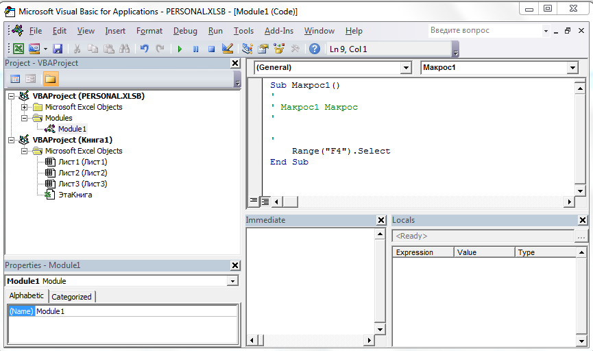

##Как добавить функцию или макрос в личную книгу макросов</h3>
Функцию/макрос добавляют в личную книгу макросов с целью общего доступа к ней из разных Excel-файлов.

        <ol>
            <li>Сначала надо создать личную книгу макросов. Для этого необходимо записать простенький макрос, Excel сам создаст книгу по требованию</li>
                        
            <li>Заходим в редактор Visual Basic (Alt+F11)</li>
            <li>Слева в обозревателе проектов найдите PERSONAL.XLSB и дважды кликните по имеющемуся у него модулю Module1</li>
                        
            <li>Замените ненужный нам код макроса на код функции</li>
            <li>Сохраните изменения, кдикнув по кнопке сохранения в меню. Теперь функция будет доступна вам из любого файла Excel на вашем компьютере</li>
            <li>Функцию можно использовать, набрав в ячейке ее имя, указав перед ним личную книгу макросов</li>  
                        
            <li>Еще проще эту функцию найти через вставку функции, выбрав в качестве категории пункт "Определенные пользователем"</li>
                        
    </ol>